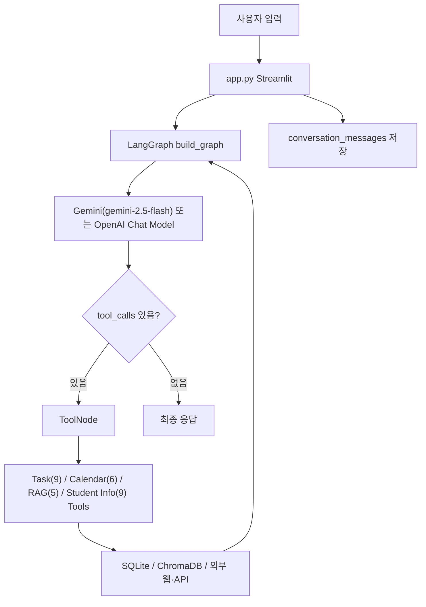

# CampusAgent 폴더 정밀 분석 보고서

분석 기준일: 2026-06-04.  
분석 위치: `C:\Users\kimka\OneDrive\Documents\GitHub\CampusAgent`.  
검증 기준: 전체 소스, 테스트, 문서, TestSprite 산출물, 현재 로컬 테스트 실행 결과.

## 1. 이전 보고서(2026-05-19) 대비 주요 변경 사항

2026-05-19 보고서 이후 약 2주 사이에 상당한 기능 구현이 완료되었다.

| 항목 | 이전 상태 (05-19) | 현재 상태 (06-04) |
|---|---|---|
| 전체 테스트 수 | 48개 통과 | **67개 통과** |
| `tests/test_agent.py` | 빈 플레이스홀더 | **3개 실제 테스트 구현** |
| `TASK_TOOLS` 도구 수 | 5개 | **9개** |
| `STUDENT_INFO_TOOLS` 도구 수 | 8개 | **9개** |
| `ALL_TOOLS` 전체 도구 수 | 24개 | **29개** |
| `assignment_subtasks` 테이블 | 미구현 (11주차 계획) | **완전 구현** |
| 서브태스크 자동 분해 | 미구현 | **규칙 기반 자동 생성 구현** |
| 대시보드 서브태스크 UI | 없음 | **진행률 바 + 체크박스 구현** |
| `app.py` 라인 수 | 529줄 | **739줄** |
| 설정 탭 개인화 항목 | 전공, 학년, 알림 기준일 | **학교명, 관심 영역, 관심 학교, 희망 진로 추가** |
| 기본 Gemini 모델 | (미명시) | **gemini-2.5-flash** |

결론적으로 현재 CampusAgent는 11주차 핵심 목표였던 "과제 자동 분해 + 서브태스크 트리"까지 완료된 상태다. 남은 주요 과제는 자동 요약 메모리 구현, ChromaDB 컬렉션 경계 정리, README 최신화다.

## 2. 전체 요약

CampusAgent는 대학생을 위한 로컬 AI 어시스턴트다. 사용자는 Streamlit 채팅 UI에서 자연어로 과제, 일정, 공지사항, 대학생 생활 정보를 요청하고, 내부에서는 LangGraph 에이전트가 LangChain `@tool`로 노출된 도구들을 호출한다.

핵심 기능은 다섯 묶음으로 정리된다.

| 묶음 | 현재 상태 |
|---|---|
| Streamlit UI | 챗봇, 과제 대시보드(서브태스크 진행률 포함), 캘린더, 설정 탭 구현. |
| LangGraph Agent | Gemini/OpenAI 자동 감지, 전체 29개 도구 바인딩, ToolNode 순환 호출, MemorySaver 사용. |
| SQLite 저장소 | 과제, 서브태스크, 일정, 사용자 설정, 대화 세션, 메시지, 요약 메모리 테이블 구현. |
| 공지사항 RAG | 학과 공지와 학교 대표 공지 크롤링, ChromaDB 저장, 유사도 검색 구현. |
| 대학생 정보 검색 | 샘플 데이터 검색, 개인화 추천, 학교 공지 실시간 검색, 외부 공공기관 검색 도구 구현. |

현재 `python -m pytest tests -q` 기준 **67개 테스트가 모두 통과**한다.

## 3. 폴더 구조와 파일 분류

현재 의미 있는 프로젝트 구조는 다음과 같다.

```text
CampusAgent/
├─ app.py                    # Streamlit UI (739줄)
├─ CLAUDE.md                 # 에이전트 가이드
├─ README.md
├─ pyproject.toml
├─ .env
├─ campus_tasks.db
├─ chroma_db_storage/
├─ agent/
│  ├─ graph.py               # LangGraph 그래프 구성
│  ├─ prompts.py             # 시스템 프롬프트
│  └─ state.py               # AgentState 정의
├─ config/
│  └─ settings.py            # 환경변수 기반 설정
├─ database/
│  ├─ db.py                  # SQLite CRUD (747줄)
│  └─ models.py              # Pydantic 데이터 모델
├─ mcp_servers/
│  ├─ task_server.py         # 과제 도구 9개
│  ├─ calendar_server.py     # 캘린더 도구 6개
│  ├─ rag_server.py          # RAG 도구 5개
│  └─ student_info_server.py # 대학생 정보 도구 9개 (1012줄)
├─ rag/
│  ├─ crawler.py             # 학과/학교 공지 크롤러
│  ├─ external_crawler.py    # 외부 공공기관 크롤러
│  ├─ loader.py
│  ├─ chunker.py
│  ├─ embedder.py
│  └─ retriever.py
├─ data/
├─ tests/
├─ md_file/
├─ testsprite_tests/
└─ .github/
```

분석상 주의할 분류는 다음과 같다.

| 분류 | 경로 | 판단 |
|---|---|---|
| 핵심 소스 | `app.py`, `agent/`, `database/`, `mcp_servers/`, `rag/`, `config/` | 실제 애플리케이션 코드. |
| 테스트 | `tests/` | 현재 67개 테스트 통과. |
| 프로젝트 문서 | `README.md`, `CLAUDE.md`, `md_file/` | 계획, 보고서, 검증 가이드. |
| 샘플/수집 데이터 | `data/` | RAG와 student-info 테스트 및 시연용. |
| 런타임 상태 | `campus_tasks.db`, `chroma_db_storage/`, `.env` | 삭제·초기화 금지 대상. |
| 생성/임시 파일 | `__pycache__/`, `.pytest_cache/`, `venv/`, `testsprite_tests/tmp/` | 분석 보조 또는 무시 대상. |
| TestSprite 산출물 | `testsprite_tests/` | 현재 코드 인터페이스와 불일치. |

## 4. 버전과 의존성 상태

| 위치 | 버전 |
|---|---|
| `pyproject.toml` | `0.9.0` |
| `config/settings.py` | `APP_VERSION = "0.9.0"` |
| `agent/prompts.py` | `CampusAgent v0.9.0` |

서브태스크 자동 분해와 개인화 추천 같은 실질적인 기능 확장이 이루어졌으나 버전은 아직 `0.9.0`으로 고정되어 있다. 현재 구현 범위는 v1.0 수준에 가깝다고 볼 수 있다.

`pyproject.toml`의 런타임 의존성은 다음을 포함한다.

- `langchain-core`, `langchain-openai`, `langchain-google-genai`
- `langgraph`
- `chromadb`
- `pydantic`
- `python-dotenv`
- `streamlit`
- `requests`, `beautifulsoup4`

`pytest`는 프로젝트 의존성에 포함되어 있지 않으므로 개발자가 별도로 설치해야 한다.

## 5. 실행 흐름

전체 흐름은 다음과 같다.



`app.py`는 앱 시작 시 `init_sqlite_db()`, `get_or_create_conversation_session()`, `init_chromadb()`, `build_graph()`를 호출한다. 사용자 입력 시 현재 시간, 전공, 학년, 개인화 프로필 전체(`_build_user_profile_context()`), 최신 메모리 요약을 `current_context`로 LangGraph에 전달한다.

LangGraph의 `thread_id`는 현재 `"streamlit_session"`으로 고정되어 있다.

## 6. Streamlit UI 분석

`app.py`는 다음 UI를 제공한다 (739줄).

| 영역 | 구현 내용 |
|---|---|
| 사이드바 | LLM 연결 상태, 긴급 알림(마감 과제, 오늘 일정, 시험 D-day), 공지 RAG 문서 수, 사용 예시. |
| 챗봇 탭 | 대화 표시(고정 높이 컨테이너), 빠른 명령 버튼, LangGraph 스트리밍 호출, RAG 후속 액션 버튼. |
| 과제 대시보드 | 과제 목록(서브태스크 포함), 서브태스크 체크박스, 진행률 바, 긴급(High) 필터 토글. |
| 캘린더 탭 | 월별 캘린더 그리드, 일정·과제 배지(우선순위 색상), 월 이동, 필터. |
| 설정 탭 | 학교, 전공, 학년, 희망 진로, 관심 영역(다중 선택), 관심 학교, 마감 알림 기준일, LLM 선호. |

### 6.1 설정 탭 개인화 항목

이전 보고서 대비 설정 탭이 크게 확장되었다.

| 항목 | 키 | 역할 |
|---|---|---|
| 학교 | `school_name` | 기본값 "인하공업전문대학". |
| 전공 | `major` | 에이전트 컨텍스트 주입. |
| 학년 | `grade` | 에이전트 컨텍스트 주입. |
| 희망 진로 | `career_goal` | 개인화 검색에 반영. |
| 관심 영역 | `info_interests` | `policy/contest/intern/transfer` 다중 선택. |
| 관심 학교 | `preferred_school` | 편입 검색에 활용. |
| 마감 알림 | `notify_days` | 사이드바 긴급 알림 기준. |

이 설정들은 `_build_user_profile_context()`로 통합되어 에이전트 시스템 프롬프트에 매 턴마다 주입된다.

### 6.2 대시보드 서브태스크 UI

과제 대시보드는 이제 `get_assignments_with_progress()`로 부모 과제와 서브태스크를 함께 조회한다.

- 각 과제 카드에 진행률 프로그레스 바가 표시된다.
- 서브태스크가 있으면 체크박스로 완료 처리할 수 있다.
- 서브태스크 체크 상태 변경 시 `update_subtask_status()`를 호출하고 `st.rerun()`으로 즉시 반영한다.
- 긴급(High) 필터 토글로 우선순위 높은 과제만 표시할 수 있다.

리스크는 `app.py`가 739줄로 커졌다는 점이다. 향후 기능이 추가되면 `ui/` 모듈 분리가 필요하다.

## 7. Agent 계층 분석

### 7.1 `agent/graph.py`

현재 바인딩되는 도구 수는 총 **29개**다.

| 도구 묶음 | 개수 |
|---|---:|
| `TASK_TOOLS` | 9 |
| `CALENDAR_TOOLS` | 6 |
| `RAG_TOOLS` | 5 |
| `STUDENT_INFO_TOOLS` | 9 |
| 합계 | **29** |

구현 흐름은 단순하고 읽기 쉽다.

- `get_llm_provider()`로 Gemini/OpenAI 자동 감지.
- API 키가 있으면 모델 생성 후 `bind_tools(ALL_TOOLS)` 호출.
- API 키 없으면 설정 안내 AIMessage 반환.
- 마지막 AIMessage에 `tool_calls`가 있으면 `ToolNode`로 이동.
- 도구 실행 후 다시 agent 노드로 돌아와 최종 응답 생성.
- `MemorySaver`로 실행 중 대화 상태를 유지.

### 7.2 `agent/state.py`

`AgentState`는 `messages`, `current_context`, `tool_calls_count`를 가진다. `tool_calls_count`는 정의되어 있지만 현재 그래프 로직에서는 사용되지 않는다.

### 7.3 `agent/prompts.py`

프롬프트는 과제, 일정, 공지사항, 대학생 정보 검색 사용 규칙을 상세히 담고 있다. 이전 보고서 이후 다음이 추가되었다.

- `add_task_with_subtasks`, `list_task_tree`, `update_subtask_status_tool`, `get_task_progress` 도구 설명 추가.
- `search_personalized_student_info` 도구 설명 추가.
- 서브태스크 관련 사용 규칙 (제목에 "발표", "PPT", "프로젝트", "레포트 계획" 등 포함 시 `add_task_with_subtasks` 우선 사용).
- 개인화 추천 사용 규칙 ("내 정보에 맞는", "나한테 맞는" 시 `search_personalized_student_info` 사용).

버전 표시는 아직 `CampusAgent v0.9.0 (장기기억 + 대학생 정보 검색 1차 확장)`으로 남아 있다. 서브태스크 기능 추가를 반영하려면 버전 문자열 업데이트가 필요하다.

## 8. SQLite 저장소 분석

`database/db.py`는 현재 다음 테이블을 생성한다.

| 테이블 | 역할 |
|---|---|
| `assignments` | 과제 저장. |
| `assignment_subtasks` | 서브태스크 저장 (FK → assignments). **신규 구현.** |
| `schedules` | 일정 저장. |
| `user_settings` | 사용자 설정. |
| `conversation_sessions` | 대화 세션 기본 정보. |
| `conversation_messages` | user/assistant/system/tool 메시지 원문 저장. |
| `memory_summaries` | 장기기억 요약 저장. |

서브태스크 관련 함수는 다음이 구현되어 있다.

- `add_subtask` / `add_subtasks`
- `get_subtasks`
- `get_assignment_progress`
- `update_subtask_status`
- `delete_subtask`
- `sync_assignment_status_from_subtasks` — 서브태스크 완료율 기반 부모 과제 상태 자동 갱신.
- `get_assignments_with_progress` — 과제 + 서브태스크 + 진행률 통합 조회.

`sync_assignment_status_from_subtasks()`는 서브태스크 추가/상태 변경/삭제 시 자동 호출되어 부모 과제 상태를 일관되게 유지한다.

장기기억 관련 상황은 이전 보고서와 동일하다. 테이블과 함수는 준비되어 있지만 `save_memory_summary()` 호출 트리거가 없다. 자동 요약 생성은 아직 미구현이다.

개선 포인트는 다음과 같다.

- 메시지 수가 일정 기준을 넘으면 요약을 생성하고 `memory_summaries`에 저장.
- `conversation_messages`가 계속 커지는 것을 막기 위해 보존 정책 설정.
- `streamlit_session` 단일 세션 ID를 추후 다중 사용자 지원 시 분리.

## 9. 데이터 모델 분석

`database/models.py`는 현재 다음 모델을 포함한다.

| 모델 | 역할 |
|---|---|
| `AssignmentCreate` | 과제 생성 요청 검증. |
| `Assignment` | DB 조회 과제 표현. |
| `AssignmentStatus` | `pending`, `in_progress`, `done`, `overdue`. |
| `SubtaskCreate` | 서브태스크 생성 요청 검증. **신규.** |
| `Subtask` | DB 조회 서브태스크 표현. **신규.** |
| `AssignmentWithProgress` | 과제 + 서브태스크 + 진행률 통합. **신규.** |
| `ScheduleCreate` | 일정 생성 요청 검증. |
| `Schedule` | DB 조회 일정 표현. |
| `ScheduleCategory` | `class`, `exam`, `personal`, `meeting`, `other`. |
| `UserSetting` | 사용자 설정 모델. |

`SubtaskCreate`는 `due_date`가 `None` 가능(Optional)하므로 서브태스크에는 마감일이 필수가 아니다. 서브태스크 마감일은 `task_server.py`의 `_subtask_due_date()`가 부모 마감일 기준 역산으로 자동 계산해 채운다.

## 10. MCP Tool 계층 분석

### 10.1 과제 도구 (9개)

`mcp_servers/task_server.py`는 현재 9개 도구를 제공한다.

- `add_task` — 기본 과제 추가.
- `add_task_with_subtasks` — 큰 과제를 추가하고 규칙 기반으로 5~7개 서브태스크 자동 생성. **신규.**
- `list_tasks` — 과제 목록 조회 (상태/과목 필터).
- `list_task_tree` — 부모 과제와 서브태스크를 계층 구조로 조회. **신규.**
- `update_task_status` — 과제 상태 변경.
- `update_subtask_status_tool` — 서브태스크 상태 변경 후 부모 진행률 자동 갱신. **신규.**
- `get_task_progress` — 특정 과제의 진행률과 남은 서브태스크 조회. **신규.**
- `delete_task` — 과제 삭제 (서브태스크 포함 CASCADE).
- `get_upcoming_deadlines` — 마감 임박 과제 조회.

`add_task_with_subtasks`의 서브태스크 자동 생성 로직(`_generate_subtask_plan`)은 제목과 설명 키워드로 과제 유형을 추정(presentation/report/coding/exam/general)하고 유형별 서식 템플릿을 적용한다. 각 서브태스크 마감일은 부모 마감일로부터 역산된다.

### 10.2 캘린더 도구 (6개)

`mcp_servers/calendar_server.py`는 6개 도구를 제공한다. 이전 보고서와 동일하다.

- `add_calendar_event`, `list_calendar_events`, `get_today_schedule`, `get_week_schedule`, `delete_calendar_event`, `check_dday`.

### 10.3 공지사항 RAG 도구 (5개)

`mcp_servers/rag_server.py`는 5개 도구를 제공한다. 이전 보고서와 동일하다.

- `search_university_notices`, `search_school_notices`, `clear_notice_data`, `load_notice_data`, `get_notice_stats`.

주의할 점은 `clear_notice_data`가 ChromaDB 컬렉션 전체를 삭제한다는 것이다. 공지사항과 대학생 정보가 같은 컬렉션을 공유하므로, 이 도구는 student-info 데이터까지 함께 지울 수 있다.

### 10.4 대학생 정보 도구 (9개)

`mcp_servers/student_info_server.py`는 현재 9개 도구를 제공한다.

- `search_student_info` — ChromaDB 기반 의미 검색.
- `search_personalized_student_info` — 설정 탭 개인화 정보 기반 맞춤 추천. **신규.**
- `search_student_info_live` — 학교 공지 실시간 크롤링 + ChromaDB 저장.
- `search_transfer_by_school` — 특정 학교 편입학 모집요강 확인 경로 검색.
- `search_scholarship_policy` — 온통청년 API로 청년정책 검색 (API 키 필요).
- `search_job_intern` — 워크넷 API로 채용공고 검색 (API 키 필요).
- `search_contest_external` — K-스타트업에서 창업지원·공모전 크롤링.
- `load_student_info_data` — 샘플 JSON 데이터 로드.
- `get_student_info_stats` — 검색 데이터 현황 확인.

`search_personalized_student_info`는 `_build_personalized_queries()`로 사용자 전공, 학년, 관심 영역, 관심 학교, 희망 진로를 조합해 카테고리별 검색 쿼리를 생성하고 ChromaDB에서 검색한다. 결과를 관련도 기준으로 정렬하고 추천 이유 레이블을 붙여 반환한다.

`search_scholarship_policy`는 개인화 청년정책 질의 감지(`_is_personalized_policy_query()`)와 조건 추출(`_extract_policy_context()`)을 구현해, 지역·나이·재학 상태·취업 상태 중 2개 이상 누락 시 바로 검색하지 않고 정보 요청 질문을 반환한다.

## 11. RAG 파이프라인 분석

이전 보고서와 동일하다.

### 11.1 `rag/loader.py`

JSON/텍스트 파일을 표준 dict 리스트로 변환. student-info는 `_load_student_info_from_json()`을 별도 사용.

### 11.2 `rag/chunker.py`

`SimpleTextChunker`: 기본 500자, overlap 50자. 한국어 문장 경계(`다.`, `요.`)를 특별히 처리하지는 않는다.

### 11.3 `rag/embedder.py`와 `rag/retriever.py`

ChromaDB `PersistentClient` 사용. 컬렉션 이름은 `university_notices` 하나로 공지사항과 대학생 정보가 공유된다.

### 11.4 `rag/crawler.py`

학과 공지(K2Web BBS)와 학교 대표 공지(`combBbs`) 크롤러가 함께 들어 있다. 요청 간 1초 딜레이와 User-Agent 사용.

### 11.5 `rag/external_crawler.py`

외부 공공기관 크롤러: 어디가(HTML), 온통청년(API), 워크넷(API+XML), K-스타트업(HTML).

## 12. 설정 파일 분석

`config/settings.py`는 다음 환경변수를 읽는다.

| 변수 | 역할 |
|---|---|
| `GOOGLE_API_KEY` | Gemini 사용. |
| `OPENAI_API_KEY` | OpenAI 사용. |
| `LLM_PROVIDER` | `auto`, `gemini`, `openai`, `none`. |
| `LLM_MODEL` | 모델명 직접 지정. 기본값: Gemini → `gemini-2.5-flash`, OpenAI → `gpt-3.5-turbo`. |
| `LLM_TEMPERATURE` | 기본값 0. |
| `SQLITE_DB_PATH` | SQLite DB 경로 override. |
| `CHROMA_DB_DIR` | ChromaDB 경로 override. |
| `YOUTH_CENTER_API_KEY` | 온통청년 API. |
| `WORKNET_API_KEY` | 워크넷 API. |

기본 Gemini 모델이 `gemini-2.5-flash`로 명시된 것이 이전 보고서와의 변경 사항이다.

## 13. 데이터 파일 분석

### 13.1 `data/sample_notices.json`

공지사항 샘플 10건. 학사, 장학, 일반, 취업 카테고리.

### 13.2 `data/crawled_notices_cse.json`

컴퓨터시스템공학과 공지 30건 (약 232KB). 본문과 첨부파일 정보 포함.

### 13.3 `data/student_info_samples.json`

편입학·전공심화, 국가제도·장학, 공모전·현장실습 카테고리 샘플 6건.

## 14. 테스트 분석

현재 테스트 파일과 역할은 다음과 같다.

| 파일 | 상태 | 주요 검증 |
|---|---|---|
| `tests/test_task.py` | 구현됨 | 과제 CRUD, 서브태스크 CRUD, 진행률 계산, 상태 자동 동기화, 서브태스크 자동 분해 템플릿. |
| `tests/test_calendar.py` | 구현됨 | 일정 CRUD, 날짜 범위, D-day. |
| `tests/test_memory.py` | 구현됨 | 대화 세션, 메시지 저장/복원, 요약 저장, 삭제. |
| `tests/test_rag.py` | 구현됨 | 로드, 청킹, ChromaDB 저장, 검색. |
| `tests/test_student_info.py` | 구현됨 | 샘플 검색, 실시간 크롤러 mock, 외부 도구 fallback. |
| `tests/test_agent.py` | **구현됨** | 신규 도구 바인딩 확인, 프롬프트 도구 언급 확인, API 키 없을 때 fallback. |

현재 실행 결과는 다음과 같다.

```text
python -m pytest tests -q
67 passed, 1 warning in 18.48s
```

경고는 Python 3.14 환경에서 ChromaDB가 `asyncio.iscoroutinefunction`을 사용하는 데 따른 DeprecationWarning이다. Python 3.16에서 제거될 예정이나 현재 기능 실패는 아니다.

### 14.1 `tests/test_task.py` 상세

기존 CRUD 외에 서브태스크 관련 테스트가 대폭 추가되었다.

- `TestSubtasks.test_add_subtask`
- `TestSubtasks.test_add_multiple_subtasks_ordered`
- `TestSubtasks.test_progress_empty_subtasks`
- `TestSubtasks.test_progress_partial_done`
- `TestSubtasks.test_progress_all_done_updates_parent`
- `TestSubtasks.test_delete_parent_removes_subtasks`
- `TestSubtasks.test_delete_subtask_resyncs_parent`
- `TestSubtasks.test_subtask_invalid_status_rejected`
- `TestSubtasks.test_get_assignments_with_progress`
- `TestSubtasks.test_generate_subtask_plan_count`

### 14.2 `tests/test_agent.py` 상세

이전 보고서에서 "빈 플레이스홀더"였던 `test_agent.py`는 이제 3개의 실제 테스트를 포함한다.

- `test_task_decomposition_tools_are_bound` — `ALL_TOOLS`에 서브태스크 관련 도구 4개와 `search_personalized_student_info`가 모두 있는지 확인.
- `test_prompt_mentions_subtask_tools` — `SYSTEM_PROMPT_TEMPLATE`에 서브태스크 도구 이름들이 명시되어 있는지 확인.
- `test_graph_fallback_without_llm` — API 키 없을 때 `"LLM API 키가 설정되지 않았습니다"` 메시지가 반환되는지 확인.

여전히 부족한 테스트는 다음이다.

- `current_context` 주입 여부 (시스템 프롬프트에 실제로 반영되는지).
- tool call이 있을 때 `tools` 노드로 분기하는지.
- 각 도구 그룹의 전체 도구 수 검증 (TASK_TOOLS 9개, CALENDAR_TOOLS 6개 등).

## 15. TestSprite 산출물 분석

`testsprite_tests/`에는 자동 테스트 생성 도구 산출물이 있다. 이 산출물은 현재 코드의 실제 인터페이스와 맞지 않는다.

| TestSprite 가정 | 실제 코드 |
|---|---|
| `POST /task` HTTP endpoint | 없음. LangChain `@tool` + Streamlit UI 중심. |
| `POST /calendar` HTTP endpoint | 없음. |
| `/debug/memory_snapshot` 등 debug endpoint | 없음. |

따라서 TestSprite 계획은 현재 기준으로 "참고용 요구사항 산출물"에 가깝고, 자동 테스트 근거로 바로 쓰기 어렵다.

## 16. 문서 상태 분석

### 16.1 `CLAUDE.md`

에이전트 가이드로 활용 가능한 수준이지만 다음 불일치가 있다.

- 파일명은 `CLAUDE.md`이지만 내용 첫 줄은 `# AGENTS.md`다.
- 섹션 11에서 "`AGENTS.md`를 업데이트하라"고 안내해 어느 파일인지 혼란이 생긴다.
- 섹션 9의 "tests/test_agent.py는 빈 플레이스홀더" 설명이 오래되어 현재 3개 테스트가 있는 상태와 맞지 않는다.

### 16.2 `README.md`

현재 코드와 다음 차이가 있다.

- 도구 수가 "20개"로 되어 있으나 실제 바인딩 도구는 29개다.
- 테스트 수 표기가 현재 67개와 다를 수 있다.
- 서브태스크 기능 설명이 없다.
- 설정 탭의 확장된 개인화 항목(희망 진로, 관심 영역 등) 설명이 없다.

### 16.3 `md_file/plan.md`

전체 15주 로드맵. 11주차 목표인 서브태스크 트리는 현재 완료되었으므로 완료 표시를 업데이트하는 것이 좋다.

### 16.4 `md_file/week_11_plan.md`

서브태스크 저장 방식으로 별도 `assignment_subtasks` 테이블을 권장했는데, 현재 구현도 이 방식을 따른다.

## 17. 현재 동작 가능성 평가

| 항목 | 현재 평가 |
|---|---|
| Python 실행 | 정상. |
| pytest 실행 | 정상, **67개 통과**. |
| SQLite 테스트 격리 | 임시 DB로 동작. |
| ChromaDB 테스트 격리 | 임시 디렉터리로 동작, teardown `ignore_errors=True`. |
| Streamlit 수동 실행 | 이번 분석에서는 실행하지 않음. |
| 외부 API live 검증 | 이번 분석에서는 실행하지 않음. |
| `.env` 값 확인 | 보안상 raw 값 미확인. |

코드 구조상 기본 기능은 실행 가능한 상태다. 외부 API(온통청년, 워크넷)와 크롤링은 원격 사이트 상태, API 키, 네트워크에 따라 달라진다.

## 18. 핵심 리스크와 개선 우선순위

### 1순위: 자동 요약 메모리 구현

현재 장기기억 테이블(`memory_summaries`)과 함수는 준비되어 있지만, 자동 요약 생성 트리거가 없다. 대화가 길어질수록 `MemorySaver`와 최근 메시지 복원만으로는 한계가 생긴다.

권장 흐름은 다음과 같다.

```text
conversation_messages N개 이상 누적
→ LLM으로 최근 대화 요약 생성
→ save_memory_summary() 저장
→ 오래된 원문 보존, 프롬프트에는 요약 중심 주입
```

### 2순위: ChromaDB 컬렉션 분리

공지사항과 대학생 정보가 같은 `university_notices` 컬렉션을 공유한다. `clear_notice_data` 호출 시 student-info 데이터까지 삭제된다. 다음 중 하나를 선택하는 것이 좋다.

- 컬렉션 분리: `university_notices`, `student_info`.
- 현재 컬렉션 유지 + `doc_type` metadata 필수화.
- 삭제 도구를 doc type 기준 삭제로 변경.

### 3순위: README 및 버전 최신화

README의 도구 수, 테스트 수, 서브태스크 기능 설명, 개인화 설정 설명이 현재 코드보다 오래됐다. `agent/prompts.py`의 버전 문자열도 기능 확장을 반영해 갱신하는 것이 좋다.

### 4순위: `CLAUDE.md` 헤더 불일치 수정

`CLAUDE.md` 파일 내부의 `# AGENTS.md` 헤더와 섹션 11의 파일명 참조를 `CLAUDE.md`로 통일해야 한다.

### 5순위: `app.py` 분리

현재 739줄이고 기능 추가 시 더 커질 것이다. 서브태스크 UI, 브리핑, 평가 탭이 추가되면 다음처럼 나누는 것이 좋다.

- `ui/sidebar.py`
- `ui/chat.py`
- `ui/task_dashboard.py`
- `ui/calendar_view.py`
- `ui/settings_view.py`

### 6순위: test_agent.py 커버리지 확대

현재 3개 테스트로 기본 바인딩은 검증하지만 다음은 아직 미검증이다.

- `current_context` 필드가 실제 시스템 프롬프트에 포맷팅되는지.
- tool call이 있을 때 `tools` 노드로 분기하는지 (실제 그래프 라우팅).
- 각 도구 그룹의 전체 도구 수.

## 19. 발표/보고서 관점 해석

현재 CampusAgent의 기술적 강점은 다음이다.

- LangGraph 기반 도구 호출 구조가 실제 DB, RAG, 외부 API 작업을 수행한다.
- SQLite와 ChromaDB를 함께 사용해 구조화 데이터와 비정형 검색을 분리했다.
- 학과 공지와 학교 대표 공지를 모두 실시간 크롤링한다.
- 과제를 자동으로 5~7개 서브태스크로 분해하고, 서브태스크 완료 시 부모 과제 상태를 자동 갱신한다.
- 개인화 추천(전공, 학년, 관심 영역, 희망 진로 기반)이 구현되어 있다.
- 설정 탭이 학교, 전공, 학년, 희망 진로, 관심 영역, 관심 학교를 통합한 개인화 프로필을 매 턴 에이전트에 주입한다.
- 테스트가 67개 있고 현재 모두 통과한다.

발표에서 조심할 표현은 다음이다.

- "요약 기반 장기기억이 완성됐다"라고 말하면 과장이다. 현재는 대화 원문 저장·복원 구현, 자동 요약 생성 미구현이다.
- "외부 API live 검색이 항상 된다"라고 단정하면 안 된다. API 키와 원격 서버 상태에 의존한다.
- "MCP 서버"라고 부를 수 있지만, 현재 코드는 독립 MCP 프로세스가 아니라 LangChain Tool 모듈 구조라는 점을 설명할 수 있어야 한다.
- "TestSprite 테스트가 현재 코드를 커버한다"고 말하면 안 된다. TestSprite 산출물은 HTTP endpoint를 가정해 현재 구현과 다르다.

## 20. 최종 결론

현재 CampusAgent는 **과제 자동 분해(서브태스크 트리), 개인화 대학생 정보 추천, 실시간 크롤링 검색, 장기기억 저장**까지 갖춘 로컬 학생 비서다. 코드 계층이 `app.py`, `agent/`, `database/`, `mcp_servers/`, `rag/`, `tests/`로 명확히 나뉘어 있고, 테스트 67개가 모두 통과한다.

이전 보고서(05-19) 대비 가장 큰 진전은 11주차 목표였던 서브태스크 자동 분해가 완전히 구현되었다는 점이다. 데이터베이스 스키마, 서비스 함수, LangChain 도구, 프롬프트 안내, Streamlit UI 모두 일관되게 구현되어 있다.

가장 중요한 남은 작업은 **자동 요약 메모리 구현**과 **ChromaDB 컬렉션 경계 정리**다. 그 다음으로 README와 버전 표기, CLAUDE.md 헤더 수정이 필요하다.

이 저장소는 발표용 시스템으로 발전할 기반이 충분하다. 다음 단계에서는 기능을 더 늘리기 전에 문서, 데이터 경계, 테스트 커버리지를 먼저 보완하는 것이 좋다.
