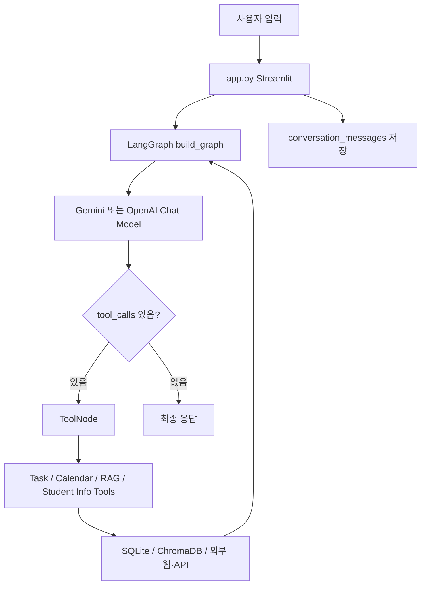

# CampusAgent 폴더 정밀 분석 보고서

분석 기준일: 2026-05-19.  
분석 위치: `C:\Users\kimka\OneDrive\Documents\GitHub\CampusAgent`.  
검증 기준: 전체 소스, 테스트, 문서, TestSprite 산출물, 현재 로컬 테스트 실행 결과.

## 1. research.md 평가 요약

기존 `research.md`는 프로젝트의 큰 구조를 잘 설명했지만, 현재 코드보다 오래된 상태를 기준으로 작성되어 있었다. 특히 작업 경로, 버전, 테스트 결과, 장기기억 구현 상태, 대학생 정보 검색 도구 수, `mcp_config.json` 불일치 항목이 현재 저장소와 맞지 않았다.

이번 수정에서는 다음을 바로잡았다.

- 분석 위치를 현재 실제 경로로 갱신했다.
- 버전 정보를 `0.9.0` 기준으로 통일했다.
- `conversation_sessions`, `conversation_messages`, `memory_summaries` 기반 장기기억 구현 상태를 반영했다.
- 대학생 정보 검색이 샘플 검색 3종을 넘어 실시간 학교 공지, 어디가, 온통청년, 워크넷, K-스타트업까지 확장된 상태를 반영했다.
- `mcp_config.json`의 RAG 도구 누락 문제는 해결된 것으로 정정하고, 현재 남은 student-info 도구 목록 불일치를 새 이슈로 기록했다.
- 현재 환경에서 `python -m pytest tests -q`가 `48 passed, 1 warning`으로 통과한 사실을 반영했다.
- TestSprite 산출물이 현재 Streamlit + LangChain Tool 구조와 맞지 않는다는 점을 최신 기준으로 다시 정리했다.

결론적으로 현재 `research.md`는 “8주차 중간 상태 보고서”에서 “0.9.0 기준 프로젝트 현황 및 다음 개선 우선순위 보고서”로 갱신되었다.

## 2. 전체 요약

CampusAgent는 대학생을 위한 로컬 AI 어시스턴트다. 사용자는 Streamlit 채팅 UI에서 자연어로 과제, 일정, 공지사항, 대학생 생활 정보를 요청하고, 내부에서는 LangGraph 에이전트가 LangChain `@tool`로 노출된 도구들을 호출한다.

핵심 기능은 다섯 묶음으로 정리된다.

| 묶음 | 현재 상태 |
|---|---|
| Streamlit UI | 챗봇, 과제 대시보드, 캘린더, 설정 탭 구현. |
| LangGraph Agent | Gemini/OpenAI 자동 감지, 전체 도구 바인딩, ToolNode 순환 호출, MemorySaver 사용. |
| SQLite 저장소 | 과제, 일정, 사용자 설정, 대화 세션, 메시지, 요약 메모리 테이블 구현. |
| 공지사항 RAG | 학과 공지와 학교 대표 공지 크롤링, ChromaDB 저장, 유사도 검색 구현. |
| 대학생 정보 검색 | 샘플 데이터 검색, 학교 공지 실시간 검색, 외부 공공기관 검색 도구 구현. |

현재 프로젝트는 기능 구현 기준으로 v0.9.0 상태다. 다만 11주차 계획인 과제 자동 분해와 서브태스크 트리는 아직 코드에 반영되지 않았다.

## 3. 폴더 구조와 파일 분류

현재 의미 있는 프로젝트 구조는 다음과 같다.

```text
CampusAgent/
├─ app.py
├─ AGENTS.md
├─ README.md
├─ pyproject.toml
├─ .env
├─ campus_tasks.db
├─ chroma_db_storage/
├─ agent/
├─ config/
├─ database/
├─ mcp_servers/
├─ rag/
├─ data/
├─ tests/
├─ md_file/
├─ testsprite_tests/
├─ .github/
├─ .claude/
├─ venv/
├─ __pycache__/
└─ kstartup_tmp.html
```

분석상 주의할 분류는 다음과 같다.

| 분류 | 경로 | 판단 |
|---|---|---|
| 핵심 소스 | `app.py`, `agent/`, `database/`, `mcp_servers/`, `rag/`, `config/` | 실제 애플리케이션 코드. |
| 테스트 | `tests/` | 현재 48개 테스트 통과. |
| 프로젝트 문서 | `README.md`, `AGENTS.md`, `md_file/` | 계획, 보고서, 검증 가이드. |
| 샘플/수집 데이터 | `data/` | RAG와 student-info 테스트 및 시연용. |
| 런타임 상태 | `campus_tasks.db`, `chroma_db_storage/`, `.env` | 삭제·초기화 금지 대상. |
| 생성/임시 파일 | `__pycache__/`, `.pytest_cache/`, `venv/`, `testsprite_tests/tmp/`, `kstartup_tmp.html` | 기본적으로 분석 보조 또는 무시 대상. |
| TestSprite 산출물 | `testsprite_tests/` | 현재 코드 인터페이스와 일부 불일치. |

주요 Python 파일 라인 수는 다음과 같다.

| 영역 | 파일 | 라인 수 |
|---|---:|---:|
| UI | `app.py` | 529 |
| Agent | `agent/graph.py` | 133 |
| Agent | `agent/prompts.py` | 98 |
| DB | `database/db.py` | 443 |
| DB Model | `database/models.py` | 129 |
| Tools | `mcp_servers/task_server.py` | 134 |
| Tools | `mcp_servers/calendar_server.py` | 156 |
| Tools | `mcp_servers/rag_server.py` | 283 |
| Tools | `mcp_servers/student_info_server.py` | 581 |
| RAG | `rag/crawler.py` | 610 |
| RAG | `rag/external_crawler.py` | 288 |
| Tests | `tests/test_student_info.py` | 172 |
| Tests | `tests/test_task.py` | 139 |

가장 큰 파일은 `rag/crawler.py`, `mcp_servers/student_info_server.py`, `app.py`, `database/db.py`다. 기능 확장이 계속되면 이 네 파일은 분리 후보가 된다.

## 4. 버전과 의존성 상태

버전 표기는 현재 주요 위치에서 일치한다.

| 위치 | 버전 |
|---|---|
| `pyproject.toml` | `0.9.0` |
| `config/settings.py` | `APP_VERSION = "0.9.0"` |
| `agent/prompts.py` | `CampusAgent v0.9.0` |
| `README.md` | 구현 기능 `v0.9.0` |

`pyproject.toml`의 런타임 의존성은 다음을 포함한다.

- `langchain-core`
- `langchain-openai`
- `langchain-google-genai`
- `langgraph`
- `chromadb`
- `pydantic`
- `python-dotenv`
- `streamlit`
- `requests`
- `beautifulsoup4`

주의할 점은 `pytest`가 프로젝트 의존성에 포함되어 있지 않다는 것이다. README에는 `pip install pytest`를 별도로 안내하고 있으므로 현재 구조상 테스트 도구는 개발자가 따로 설치해야 한다.

## 5. 실행 흐름

전체 흐름은 다음과 같다.



`app.py`는 앱 시작 시 `init_sqlite_db()`, `get_or_create_conversation_session()`, `init_chromadb()`, `build_graph()`를 호출한다. 사용자 입력 시 현재 시간, 전공, 학년, 최신 메모리 요약을 `current_context`로 LangGraph에 전달한다.

LangGraph의 `thread_id`는 현재 `"streamlit_session"`으로 고정되어 있다. 단일 사용자 로컬 앱에는 단순하고 충분하지만, 여러 사용자 또는 여러 대화방을 지원하려면 세션 분리가 필요하다.

## 6. Streamlit UI 분석

`app.py`는 다음 UI를 제공한다.

| 영역 | 구현 내용 |
|---|---|
| 사이드바 | LLM 연결 상태, 긴급 알림, 공지 RAG 문서 수, 사용 예시. |
| 챗봇 탭 | 대화 표시, 빠른 명령 버튼, LangGraph 스트리밍 호출, RAG 후속 액션 버튼. |
| 과제 대시보드 | 과제 목록 DataEditor 표시, 완료 체크 시 DB 업데이트. |
| 캘린더 탭 | 월별 캘린더, 일정·과제 배지, 월 이동, 필터. |
| 설정 탭 | 전공, 학년, 마감 알림 기준일, 선호 LLM 표시. |

좋은 점은 사용자 흐름이 명확하다는 것이다. 자연어 입력을 중심에 두면서도 과제와 캘린더는 직접 조작 가능한 대시보드로 제공한다.

리스크는 `app.py`가 UI, CSS, DB 호출, LangGraph 호출, 채팅 저장, 캘린더 렌더링을 모두 포함해 점점 커지고 있다는 점이다. 11주차 이후 서브태스크 UI까지 들어가면 `app.py` 분리 필요성이 커진다.

## 7. Agent 계층 분석

### 7.1 `agent/graph.py`

`agent/graph.py`는 LangGraph 에이전트의 중심이다.

현재 바인딩되는 도구 수는 총 24개다.

| 도구 묶음 | 개수 |
|---|---:|
| `TASK_TOOLS` | 5 |
| `CALENDAR_TOOLS` | 6 |
| `RAG_TOOLS` | 5 |
| `STUDENT_INFO_TOOLS` | 8 |
| 합계 | 24 |

README의 아키텍처 설명에는 아직 “20개 도구” 표현이 남아 있어 최신 코드와 다르다. README 보완 시 24개 또는 “20개 이상”으로 갱신하는 것이 좋다.

구현 흐름은 단순하고 읽기 쉽다.

- `get_llm_provider()`로 Gemini/OpenAI 자동 감지.
- 사용 가능한 API 키가 있으면 모델 생성 후 `bind_tools(ALL_TOOLS)` 호출.
- API 키가 없으면 설정 안내 AIMessage 반환.
- 마지막 AIMessage에 `tool_calls`가 있으면 `ToolNode`로 이동.
- 도구 실행 후 다시 agent 노드로 돌아와 최종 응답 생성.
- `MemorySaver`로 실행 중 대화 상태를 유지.

### 7.2 `agent/state.py`

`AgentState`는 `messages`, `current_context`, `tool_calls_count`를 가진다.

`tool_calls_count`는 정의되어 있지만 현재 그래프 로직에서는 사용되지 않는다. 무한 도구 호출 방지나 재시도 제한을 넣을 때 활용할 수 있는 필드지만, 지금은 미사용 상태다.

### 7.3 `agent/prompts.py`

프롬프트는 과제, 일정, 공지사항, 대학생 정보 검색 사용 규칙을 꽤 상세히 담고 있다. 특히 상대 날짜를 현재 시스템 시간 기준으로 절대 날짜로 변환하라는 지시가 있어 Pydantic 날짜 검증과 잘 맞는다.

보완점은 두 가지다.

- 현재 프롬프트는 도구 결과를 항상 엄격한 템플릿으로 재구성하라고 지시하지만, 실제 도구 응답 자체도 이미 긴 마크다운을 반환한다. 모델이 도구 응답을 다시 포장하면서 중복되거나 길어질 수 있다.
- 11주차 과제 자동 분해 도구가 추가되면 과제 관리 도구 목록과 사용 규칙을 반드시 갱신해야 한다.

## 8. SQLite 저장소 분석

`database/db.py`는 현재 다음 테이블을 생성한다.

| 테이블 | 역할 |
|---|---|
| `assignments` | 과제 저장. |
| `schedules` | 일정 저장. |
| `user_settings` | 전공, 학년, 알림 기준일 등 사용자 설정. |
| `conversation_sessions` | 대화 세션 기본 정보. |
| `conversation_messages` | user/assistant/system/tool 메시지 원문 저장. |
| `memory_summaries` | 장기기억 요약 저장. |

장기기억 함수는 다음이 구현되어 있다.

- `get_or_create_conversation_session`
- `save_conversation_message`
- `load_recent_conversation_messages`
- `save_memory_summary`
- `get_latest_memory_summary`
- `clear_conversation_history`

현재 장기기억은 “대화 원문 저장과 최근 메시지 복원”까지는 구현되어 있다. 다만 자동 요약 생성 트리거는 없다. 즉 `memory_summaries` 테이블과 함수는 준비되어 있지만, 앱 흐름에서 `save_memory_summary()`를 호출하는 코드는 아직 없다.

개선 포인트는 다음과 같다.

- `streamlit_session` 단일 세션 ID를 사용자별 또는 대화방별 ID로 분리한다.
- 메시지 수가 일정 기준을 넘으면 요약을 생성하고 `memory_summaries`에 저장한다.
- `conversation_messages`가 계속 커지는 것을 막기 위해 보존 정책을 둔다.
- `get_upcoming_assignments()`는 문자열 `BETWEEN` 비교를 사용하므로 `YYYY-MM-DD HH:MM` 경계값을 더 엄밀히 다룰 여지가 있다.

## 9. 데이터 모델 분석

`database/models.py`는 Pydantic 모델로 과제와 일정을 검증한다.

| 모델 | 역할 |
|---|---|
| `AssignmentCreate` | 과제 생성 요청 검증. |
| `Assignment` | DB 조회 과제 표현. |
| `AssignmentStatus` | `pending`, `in_progress`, `done`, `overdue`. |
| `ScheduleCreate` | 일정 생성 요청 검증. |
| `Schedule` | DB 조회 일정 표현. |
| `ScheduleCategory` | `class`, `exam`, `personal`, `meeting`, `other`. |

날짜 검증은 명확하다.

- 과제 마감일은 `YYYY-MM-DD` 또는 `YYYY-MM-DD HH:MM`.
- 일정 날짜는 `YYYY-MM-DD`.

이 구조는 DB에 자연어 날짜가 들어가는 것을 막는 장점이 있다. 대신 “내일”, “다음 주 수요일” 같은 표현은 에이전트가 도구 호출 전에 반드시 절대 날짜로 바꿔야 한다.

11주차 서브태스크 기능을 구현하려면 `SubtaskCreate`, `Subtask`, 진행률 표현 모델이 추가될 가능성이 높다.

## 10. MCP Tool 계층 분석

이 저장소의 `mcp_servers/`는 실제 독립 MCP 서버 프로세스라기보다 LangChain `@tool` 함수 모음에 가깝다.

### 10.1 과제 도구

`mcp_servers/task_server.py`는 5개 도구를 제공한다.

- `add_task`
- `list_tasks`
- `update_task_status`
- `delete_task`
- `get_upcoming_deadlines`

기존 CRUD 범위는 안정적이다. 11주차 목표인 “과제 자동 분해 + 서브태스크 트리”는 아직 미구현이므로 이 파일이 다음 핵심 변경 지점이다.

### 10.2 캘린더 도구

`mcp_servers/calendar_server.py`는 6개 도구를 제공한다.

- `add_calendar_event`
- `list_calendar_events`
- `get_today_schedule`
- `get_week_schedule`
- `delete_calendar_event`
- `check_dday`

일정 추가는 `ScheduleCreate`를 통해 날짜 형식을 검증한다. 현재 테스트도 충분히 기본 CRUD와 D-day를 커버한다.

### 10.3 공지사항 RAG 도구

`mcp_servers/rag_server.py`는 5개 도구를 제공한다.

- `search_university_notices`
- `search_school_notices`
- `clear_notice_data`
- `load_notice_data`
- `get_notice_stats`

학과 공지 검색은 먼저 ChromaDB 캐시를 확인하고, 관련 결과가 부족하면 학과 홈페이지를 실시간 크롤링한다. 학교 대표 공지 검색은 대표 홈페이지를 실시간 크롤링한 뒤 ChromaDB에 저장한다.

주의할 점은 `clear_notice_data`가 ChromaDB 컬렉션 전체를 삭제한다는 것이다. 현재 공지사항과 대학생 정보가 같은 컬렉션을 공유하므로, 이 도구는 student-info 데이터까지 함께 지울 수 있다.

### 10.4 대학생 정보 도구

`mcp_servers/student_info_server.py`는 현재 8개 도구를 제공한다.

- `search_student_info`
- `search_student_info_live`
- `search_transfer_by_school`
- `search_scholarship_policy`
- `search_job_intern`
- `search_contest_external`
- `load_student_info_data`
- `get_student_info_stats`

이 영역은 기존 research.md보다 크게 확장되었다. 학교 대표 공지 기반 실시간 검색뿐 아니라 어디가, 온통청년, 워크넷, K-스타트업까지 연결되어 있다.

주의할 점은 외부 API 키가 없으면 일부 도구가 설정 안내를 반환한다는 것이다. 이 동작은 실패가 아니라 정상적인 fallback이다.

## 11. RAG 파이프라인 분석

### 11.1 `rag/loader.py`

JSON 또는 텍스트 파일을 표준 dict 리스트로 변환한다. 공지사항 샘플 데이터에는 충분하지만, student-info 전용 필드인 `deadline`, `target`은 별도 로더가 더 잘 보존한다. 실제로 student-info 쪽은 `_load_student_info_from_json()`을 따로 구현해 사용한다.

### 11.2 `rag/chunker.py`

`SimpleTextChunker`는 기본 500자, overlap 50자로 텍스트를 자른다. 문장 경계로 `\n\n`, `\n`, `. `, `? `, `! `를 고려한다.

한국어 문장 종결인 `다.`, `요.` 같은 패턴을 특별히 처리하지는 않는다. 검색 품질을 높이려면 한국어 문장 경계 처리 또는 토큰 기반 청킹을 검토할 수 있다.

### 11.3 `rag/embedder.py`와 `rag/retriever.py`

ChromaDB `PersistentClient`를 사용한다. 컬렉션 이름은 `university_notices` 하나다.

장점은 구조가 단순하다는 것이다. 단점은 공지사항과 대학생 정보가 같은 컬렉션을 공유해 데이터 관리 경계가 약하다는 것이다. 현재는 `category`와 `source` metadata로 구분하지만, `clear_notice_data` 같은 전체 삭제 도구에는 취약하다.

### 11.4 `rag/crawler.py`

학과 공지와 대표 홈페이지 공지 크롤러가 함께 들어 있다.

| 대상 | 구현 방식 |
|---|---|
| 학과 공지 | K2Web BBS, `enc` 파라미터 생성, 목록·상세·첨부 추출. |
| 학교 대표 공지 | `combBbs`, `javascript:jf_combBbs_view(...)` URL 변환, 목록·상세·첨부 추출. |

크롤러는 요청 간 1초 딜레이와 User-Agent를 사용한다. 다만 학교 홈페이지 HTML 구조가 바뀌면 파서가 깨질 수 있으므로, live 검색 실패는 코드 버그와 네트워크·원격 구조 변경을 구분해야 한다.

### 11.5 `rag/external_crawler.py`

외부 대학생 정보 소스를 다룬다.

| 함수 | 소스 | 성격 |
|---|---|---|
| `crawl_transfer_by_school` | 어디가 | HTML 크롤링. |
| `fetch_youth_policy` | 온통청년 | API 키 필요. |
| `fetch_worknet_jobs` | work24 워크넷 | API 키 필요, XML 파싱. |
| `crawl_kstartup_contest` | K-스타트업 | HTML 크롤링. |

주의할 점은 `crawl_transfer_by_school()`이 실제 결과가 없어도 안내용 fallback 항목을 반환한다는 것이다. 사용자 경험에는 좋지만, “실제 크롤링 성공”과 “직접 확인 안내”를 구분해 보고할 때는 주의해야 한다.

## 12. 설정 파일 분석

`config/settings.py`는 다음 환경변수를 읽는다.

| 변수 | 역할 |
|---|---|
| `GOOGLE_API_KEY` | Gemini 사용. |
| `OPENAI_API_KEY` | OpenAI 사용. |
| `LLM_PROVIDER` | `auto`, `gemini`, `openai`, `none`. |
| `LLM_MODEL` | 모델명 직접 지정. |
| `LLM_TEMPERATURE` | 모델 temperature. |
| `SQLITE_DB_PATH` | SQLite DB 경로 override. |
| `CHROMA_DB_DIR` | ChromaDB 경로 override. |
| `YOUTH_CENTER_API_KEY` | 온통청년 API. |
| `WORKNET_API_KEY` | 워크넷 API. |

현재 `.env` 파일은 존재하지만, 민감정보 보호를 위해 실제 값은 분석 문서에 기록하지 않는다.

`config/mcp_config.json`은 RAG 도구 목록에는 현재 코드와 맞게 `search_school_notices`가 포함되어 있다. 그러나 `student_info_server.tools`에는 실제 8개 도구 중 3개만 적혀 있다. 현재 LangGraph는 이 JSON이 아니라 Python의 `STUDENT_INFO_TOOLS`를 직접 사용하므로 앱 동작에는 큰 영향이 없지만, 문서·레지스트리 용도로는 불일치다.

보완 필요 목록은 다음과 같다.

- `search_student_info_live`
- `search_transfer_by_school`
- `search_scholarship_policy`
- `search_job_intern`
- `search_contest_external`

## 13. 데이터 파일 분석

### 13.1 `data/sample_notices.json`

공지사항 샘플 10건이 있다. 학사, 장학, 일반, 취업 카테고리를 포함한다. RAG 기본 테스트와 로컬 로드 시연에 적합하다.

### 13.2 `data/crawled_notices_cse.json`

컴퓨터시스템공학과 공지 30건이 들어 있다. 크기는 약 232KB이며 본문과 첨부파일 정보가 포함되어 있다. 실제 공지 검색 데이터셋으로 활용 가치가 높다.

### 13.3 `data/student_info_samples.json`

편입학·전공심화, 국가제도·장학, 공모전·현장실습 카테고리 샘플 6건이 있다. `deadline`, `target`, `source`, `url`이 포함되어 있어 student-info 검색 응답의 기반이 된다.

## 14. 테스트 분석

현재 테스트 파일과 역할은 다음과 같다.

| 파일 | 상태 | 주요 검증 |
|---|---|---|
| `tests/test_task.py` | 구현됨 | 과제 CRUD, 상태 변경, 삭제, ID 조회. |
| `tests/test_calendar.py` | 구현됨 | 일정 CRUD, 날짜 범위, D-day. |
| `tests/test_memory.py` | 구현됨 | 대화 세션, 메시지 저장/복원, 요약 저장, 삭제. |
| `tests/test_rag.py` | 구현됨 | 로드, 청킹, ChromaDB 저장, 검색. |
| `tests/test_student_info.py` | 구현됨 | 샘플 검색, 실시간 크롤러 mock, 외부 도구 fallback. |
| `tests/test_agent.py` | 비어 있음 | Agent 구성 테스트 없음. |

현재 실행 결과는 다음과 같다.

```text
python -m pytest tests -q
48 passed, 1 warning in 13.27s
```

경고는 Python 3.14 환경에서 ChromaDB가 `asyncio.iscoroutinefunction`을 사용하는 데 따른 DeprecationWarning이다. 기능 실패는 아니다.

테스트 품질상 가장 큰 빈틈은 `tests/test_agent.py`가 비어 있다는 점이다. LangGraph 도구 라우팅, API 키 없음 fallback, `current_context` 주입, `ALL_TOOLS` 구성 검증은 아직 자동화되어 있지 않다.

## 15. TestSprite 산출물 분석

`testsprite_tests/`에는 자동 테스트 생성 도구 산출물이 있다.

문제는 이 산출물이 현재 코드의 실제 인터페이스와 맞지 않는다는 점이다.

| TestSprite 가정 | 실제 코드 |
|---|---|
| `POST /task` HTTP endpoint | 없음. LangChain `@tool` 함수와 Streamlit UI 중심. |
| `POST /calendar` HTTP endpoint | 없음. |
| `/debug/memory_snapshot` 등 debug endpoint | 없음. |
| HTTP backend service | 현재는 Streamlit 앱 + 로컬 Python 모듈 구조. |

따라서 TestSprite 계획은 현재 기준으로 “참고용 요구사항 산출물”에 가깝고, 자동 테스트 근거로 바로 쓰기 어렵다. 계속 활용하려면 FastAPI 같은 HTTP 계층을 실제로 추가하거나, TestSprite 계획을 함수 호출·Streamlit 흐름 기준으로 다시 작성해야 한다.

`testsprite_tests/tmp/config.json` 같은 tmp 파일은 도구 실행 설정과 민감할 수 있는 값이 들어갈 수 있으므로 제출물이나 공개 저장소에 포함하지 않는 것이 안전하다.

## 16. 문서 상태 분석

### 16.1 `README.md`

README는 전체 설명이 잘 되어 있지만 현재 코드와 일부 차이가 있다.

- 아키텍처 설명의 도구 수가 20개로 되어 있으나 실제 바인딩 도구는 24개다.
- 대학생 정보 검색 표에는 4개 도구만 소개되어 있으나 실제 도구는 8개다.
- 테스트 수는 “44개”로 표현되어 있으나 현재는 48개 테스트가 통과한다.
- `data/crawled_notices_cse.json`, `testsprite_tests`, 런타임 상태 파일 설명은 축약되어 있다.

README는 발표·사용자 안내용으로 좋지만, 다음 문서 정리 때 최신 도구 수와 테스트 수를 갱신하는 것이 좋다.

### 16.2 `md_file/plan.md`

전체 15주 로드맵을 담고 있으며, 현재 코드와 대체로 맞는다. 11주차 목표는 과제 자동 분해와 서브태스크 트리다. 현재 코드에는 아직 반영되지 않았으므로 `plan.md`의 11주차는 앞으로 구현할 항목으로 봐야 한다.

### 16.3 `md_file/week_10_plan.md`와 `week_10_report.md`

10주차의 장기기억과 대학생 정보 검색 구현 흐름을 잘 설명한다. 현재 코드와 가장 잘 맞는 문서다.

다만 `week_10_report.md`의 프로젝트 구조 하단에는 `tests/test_student_info.py` 설명이 “신규: 대학생 정보 2개 테스트”로 남아 있는데, 현재는 8개 테스트다. 표의 테스트 결과는 8개로 맞게 적혀 있어 일부 설명만 오래됐다.

### 16.4 `md_file/week_11_plan.md`

과제 자동 분해 기능의 구현 계획이 상세하다. 현재 시점에서는 아직 계획 문서이며, 코드에는 `assignment_subtasks` 테이블이나 자동 분해 도구가 없다.

중요한 점은 `cleanup_plan.md`와 `week_11_plan.md`가 서브태스크 저장 방식에서 서로 다른 방향을 제시한다는 것이다.

- `week_11_plan.md`: 별도 `assignment_subtasks` 테이블 권장.
- `cleanup_plan.md`: `assignments`에 `parent_id`, `progress` 컬럼 추가 제안.

데이터 안전과 기존 CRUD 유지 관점에서는 `week_11_plan.md`의 별도 테이블 방식이 더 안전하다.

### 16.5 `md_file/verification_guide.md`

외부 API와 Streamlit end-to-end 검증 절차가 잘 정리되어 있다. 단, 이 문서는 `.env`에 API 키가 설정되어 있다는 전제를 둔다. 공개 제출용 문서로 쓸 때는 키 존재 여부만 말하고 실제 값을 기록하지 않아야 한다.

## 17. 현재 동작 가능성 평가

현재 로컬 환경에서는 Python과 pytest가 정상 동작한다. 전체 테스트도 통과했다.

| 항목 | 현재 평가 |
|---|---|
| Python 실행 | 정상. |
| pytest 실행 | 정상, 48개 통과. |
| SQLite 테스트 격리 | 임시 DB로 동작. |
| ChromaDB 테스트 격리 | 임시 디렉터리로 동작, teardown은 `ignore_errors=True`. |
| Streamlit 수동 실행 | 이번 분석에서는 실행하지 않음. |
| 외부 API live 검증 | 이번 분석에서는 실행하지 않음. |
| `.env` 값 확인 | 보안상 raw 값 미확인. |

코드 구조상 기본 기능은 실행 가능한 상태로 판단된다. 다만 외부 API와 크롤링은 원격 사이트 상태, API 키, 네트워크에 따라 달라지므로 자동 테스트 결과만으로 live 기능 전체를 보장할 수는 없다.

## 18. 핵심 리스크와 개선 우선순위

### 1순위: `config/mcp_config.json` student-info 도구 목록 동기화

실제 `STUDENT_INFO_TOOLS`는 8개지만 설정 파일에는 3개만 있다. 현재 앱은 Python 리스트를 직접 쓰므로 즉시 장애는 아니지만, 문서·레지스트리·외부 도구 연동 기준으로는 불일치다.

### 2순위: `tests/test_agent.py` 작성

Agent 계층은 핵심인데 자동 테스트가 없다. 최소한 다음은 테스트하는 것이 좋다.

- `ALL_TOOLS`에 expected tool name이 모두 들어 있는지.
- API 키가 없을 때 fallback 메시지를 반환하는지.
- `current_context`의 현재 시간, 전공, 학년, memory summary가 프롬프트에 반영되는지.
- tool call이 있으면 `tools` 노드로 가는지.

### 3순위: ChromaDB 컬렉션 분리

공지사항과 대학생 정보가 같은 `university_notices` 컬렉션을 공유한다. 짧게는 metadata 필터로 버틸 수 있지만, 장기적으로는 다음 중 하나를 선택하는 것이 좋다.

- 컬렉션 분리: `university_notices`, `student_info`.
- 현재 컬렉션 유지 + `doc_type` metadata 필수화.
- 삭제 도구를 doc type 기준 삭제로 변경.

### 4순위: 요약 메모리 자동 생성

현재 장기기억 테이블은 있지만 자동 요약 생성은 없다. 대화가 길어질수록 최근 메시지 복원만으로는 한계가 생긴다.

권장 흐름은 다음과 같다.

```text
conversation_messages N개 이상 누적
-> 최근 대화 요약 생성
-> save_memory_summary 저장
-> 오래된 원문은 보존하되 프롬프트에는 요약 중심 주입
```

### 5순위: README 최신화

README의 도구 수, 테스트 수, student-info 도구 목록이 현재 코드보다 오래됐다. 발표 자료나 제출 자료로 쓰려면 업데이트가 필요하다.

### 6순위: 11주차 과제 자동 분해 구현

현재 계획은 잘 정리되어 있다. 구현 시에는 기존 `assignments` 테이블을 크게 바꾸는 방식보다 별도 `assignment_subtasks` 테이블을 추가하는 방식이 안전하다.

### 7순위: `app.py` 분리

기능이 늘면서 `app.py`가 529줄까지 커졌다. 당장 문제는 아니지만 서브태스크 UI, 브리핑, 평가 탭이 추가되면 다음처럼 나누는 것이 좋다.

- `ui/sidebar.py`
- `ui/chat.py`
- `ui/task_dashboard.py`
- `ui/calendar_view.py`
- `ui/settings_view.py`

## 19. 발표/보고서 관점 해석

현재 CampusAgent는 단순 CRUD 앱보다 기술적으로 설명할 지점이 많다.

강점은 다음이다.

- LangGraph 기반 도구 호출 구조가 실제 DB와 RAG 작업을 수행한다.
- SQLite와 ChromaDB를 함께 사용해 구조화 데이터와 비정형 검색을 분리했다.
- 학과 공지와 학교 대표 공지를 모두 실시간 크롤링한다.
- 장기기억 저장 테이블과 최근 대화 복원 흐름이 구현되어 있다.
- 대학생 정보 검색이 샘플 데이터, 학교 공지, 외부 공공 API·크롤러로 확장되어 있다.
- 테스트가 48개 있고 현재 통과한다.

발표에서 조심할 표현은 다음이다.

- “요약 기반 장기기억이 완성됐다”라고 말하면 과장이다. 현재는 대화 원문 저장·복원은 구현, 자동 요약 생성은 미구현이다.
- “외부 API live 검색이 항상 된다”라고 단정하면 안 된다. API 키와 원격 서버 상태에 의존한다.
- “MCP 서버”라고 부를 수는 있지만, 현재 코드는 독립 MCP 프로세스보다 LangChain Tool 모듈 구조에 가깝다는 점을 설명할 수 있어야 한다.
- “TestSprite 테스트 계획이 곧 현재 백엔드 테스트다”라고 말하면 안 된다. TestSprite 산출물은 HTTP endpoint를 가정해 현재 구현과 다르다.

## 20. 최종 결론

현재 CampusAgent는 v0.9.0 기준으로 과제·일정·공지 RAG·대학생 정보 검색·장기기억 저장을 갖춘 로컬 학생 비서다. 코드 계층도 `app.py`, `agent/`, `database/`, `mcp_servers/`, `rag/`, `tests/`로 비교적 명확히 나뉘어 있다.

가장 좋은 점은 핵심 기능이 실제 테스트로 상당 부분 검증되어 있다는 것이다. 현재 `python -m pytest tests -q` 기준 48개 테스트가 모두 통과한다.

가장 중요한 남은 작업은 Agent 테스트 작성, ChromaDB 데이터 경계 정리, `mcp_config.json`과 README 최신화, 자동 요약 메모리 구현, 11주차 서브태스크 기능 구현이다.

요약하면 이 저장소는 “기능 구현 중심의 중간 결과물”을 넘어 “최종 발표용 시스템”으로 발전할 기반이 충분하다. 다음 단계에서는 기능을 더 늘리기 전에 설정·문서·테스트·데이터 경계를 맞추는 작업을 병행해야 한다.
