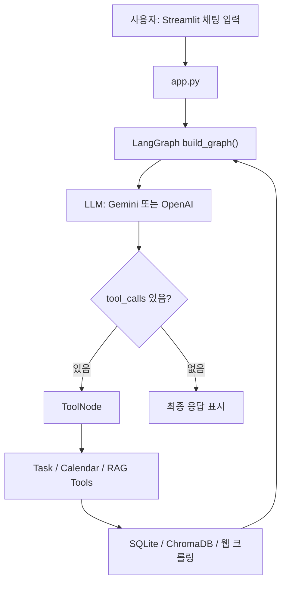

# CampusAgent 폴더 정밀 분석 보고서

분석 기준일: 2026-05-09  
분석 위치: `C:\workspace\CampusAgent`

## 1. 전체 요약

이 폴더는 대학생 특화 로컬 AI 어시스턴트인 **CampusAgent** 프로젝트이다. 사용자는 Streamlit 채팅 UI에서 자연어로 과제, 일정, 공지사항 검색을 요청하고, 내부에서는 LangGraph 에이전트가 LangChain `@tool`로 노출된 과제/캘린더/RAG 도구를 호출한다. 데이터 저장은 과제와 일정에는 SQLite, 공지사항 검색에는 ChromaDB 벡터 저장소를 사용한다.

현재 코드 기준 핵심 기능은 다음 네 묶음으로 정리된다.

- Streamlit 기반 사용자 인터페이스: 채팅, 과제 대시보드, 캘린더, 사용자 설정 탭
- LangGraph 기반 에이전트: Gemini/OpenAI 자동 감지, ToolNode 순환 호출, MemorySaver 세션 메모리
- 로컬 데이터 관리: SQLite 과제/일정/사용자 설정 CRUD
- 공지사항 RAG: JSON 로더, 텍스트 청킹, ChromaDB 임베딩 저장, 실시간 학과/학교 공지 크롤링

주의할 점도 있다. `README.md`는 v0.8.0 기능이라고 설명하지만, `config/settings.py`의 `APP_VERSION`은 `0.7.0`으로 되어 있고, `agent/prompts.py`의 시스템 프롬프트는 v0.8.0이라고 적혀 있다. 즉 문서, 앱 표시 버전, 프롬프트 버전 사이에 불일치가 있다.

또한 현재 워크스페이스에서 `python`, `py`, `venv\Scripts\python.exe`, `.venv\Scripts\python.exe`가 모두 정상 실행되지 않았다. 따라서 현재 환경에서는 앱 실행과 테스트 재검증이 막혀 있으며, 기존 `test_output.txt`에 남아 있는 테스트 결과와 코드 읽기를 기준으로 상태를 판단해야 한다.

## 2. 폴더 구조와 파일 분류

의미 있는 프로젝트 파일은 다음과 같이 구성되어 있다. `venv`, `.venv`, `__pycache__`, `chroma_db_storage`는 대량의 생성/저장 파일이므로 코드 분석에서는 별도 산출물로 분류했다.

```text
CampusAgent/
├─ app.py
├─ pyproject.toml
├─ README.md
├─ research.md
├─ .env
├─ .gitattributes
├─ gemini_models.txt
├─ campus_tasks.db
├─ test.py
├─ test_output.txt
├─ tmp_streamlit.log
├─ agent/
├─ config/
├─ database/
├─ mcp_servers/
├─ rag/
├─ data/
├─ tests/
├─ testsprite_tests/
├─ chroma_db_storage/
├─ venv/
├─ .venv/
├─ .github/
└─ .claude/
```

주요 소스 라인 수는 다음과 같다.

| 영역 | 파일 | 라인 수 | 역할 |
|---|---:|---:|---|
| UI | `app.py` | 약 20KB | Streamlit 메인 앱 |
| Agent | `agent/graph.py` | 130 | LangGraph 에이전트 구성 |
| Agent | `agent/prompts.py` | 75 | 시스템 프롬프트 |
| Agent | `agent/state.py` | 10 | AgentState 정의 |
| DB | `database/db.py` | 286 | SQLite CRUD |
| DB | `database/models.py` | 129 | Pydantic 모델/검증 |
| Tools | `mcp_servers/task_server.py` | 134 | 과제 도구 5개 |
| Tools | `mcp_servers/calendar_server.py` | 156 | 캘린더 도구 6개 |
| Tools | `mcp_servers/rag_server.py` | 283 | RAG/크롤링 도구 5개 |
| RAG | `rag/crawler.py` | 610 | 학과/학교 공지 크롤러 |
| RAG | `rag/loader.py` | 80 | JSON/텍스트 로더 |
| RAG | `rag/chunker.py` | 62 | 텍스트 청커 |
| RAG | `rag/embedder.py` | 65 | ChromaDB 저장 |
| RAG | `rag/retriever.py` | 74 | ChromaDB 검색 |
| Config | `config/settings.py` | 59 | 환경변수/앱 설정 |
| Tests | `tests/test_task.py` | 139 | 과제 DB 테스트 |
| Tests | `tests/test_calendar.py` | 125 | 캘린더 DB 테스트 |
| Tests | `tests/test_rag.py` | 120 | RAG 파이프라인 테스트 |
| Tests | `tests/test_agent.py` | 0 | 비어 있음 |

## 3. 실행 흐름

전체 실행 흐름은 다음과 같다.



`app.py`는 앱 시작 시 `init_sqlite_db()`, `init_chromadb()`, `build_graph()`를 호출한다. 이후 사용자가 메시지를 입력하면 현재 시간, 전공, 학년 정보를 `current_context`에 넣어 LangGraph에 전달한다. LangGraph는 `MemorySaver` 체크포인터를 사용하며 `thread_id`는 `"streamlit_session"`으로 고정되어 있다.

## 4. 의존성과 프로젝트 설정

`pyproject.toml` 기준 프로젝트명은 `campus-agent`, 버전은 `0.6.0`이다. 주요 의존성은 다음과 같다.

- `langchain-core`
- `langchain-openai`
- `langchain-google-genai`
- `langgraph`
- `chromadb`
- `pydantic`
- `python-dotenv`
- `streamlit`
- `requests`
- `beautifulsoup4`

버전 표기가 세 곳에서 다르다.

| 위치 | 버전 |
|---|---|
| `pyproject.toml` | `0.6.0` |
| `config/settings.py` | `0.7.0` |
| `README.md`, `agent/prompts.py` 설명 | `0.8.0` |

이 부분은 발표/보고서/앱 화면에서 혼동될 수 있으므로 하나의 버전으로 정리하는 것이 좋다.

## 5. 환경변수와 보안 관련 파일

`.env`에는 `GOOGLE_API_KEY` 키 이름이 존재한다. 실제 값은 보고서에 기록하지 않는다. `config/settings.py`는 다음 우선순위로 LLM 제공자를 감지한다.

1. `LLM_PROVIDER`가 `auto`가 아니면 해당 값 사용
2. `GOOGLE_API_KEY`가 있으면 `gemini`
3. `OPENAI_API_KEY`가 있으면 `openai`
4. 둘 다 없으면 `none`

기본 모델은 Gemini 사용 시 `gemini-2.5-flash`, OpenAI 사용 시 `gpt-3.5-turbo`이다.

주의: `testsprite_tests/tmp/config.json` 안에는 외부 테스트 도구 설정과 민감할 수 있는 API/프록시 값이 들어 있다. 이 파일은 Git에 포함하거나 제출 자료에 그대로 첨부하지 않는 것이 안전하다.

## 6. `app.py` 상세 분석

`app.py`는 Streamlit 기반 메인 애플리케이션이다. 주요 화면 구성은 사이드바와 4개 탭이다.

사이드바 기능:

- 앱 이름/버전/설명 표시
- LLM API 키 설정 여부 표시
- 오늘 마감 과제, 오늘 일정, 시험 D-day 긴급 알림
- ChromaDB 공지사항 저장 문서 수 표시
- 사용 예시 안내

메인 탭:

- `챗봇`: 자연어 대화, 빠른 명령 버튼, LangGraph 스트리밍 처리
- `과제 대시보드`: SQLite 과제 목록을 DataFrame/DataEditor로 표시, 완료 체크 시 DB 업데이트
- `캘린더`: 월별 달력 렌더링, 일정/과제 배지 표시, 월 이동
- `설정`: 전공, 학년, 알림 기준일, 선호 LLM 값 저장

좋은 점:

- 사용자가 자주 쓰는 명령을 버튼으로 제공해 진입 장벽을 낮춘다.
- 과제 완료 처리를 대시보드에서 직접 체크할 수 있다.
- `current_time`, `user_major`, `user_grade`를 에이전트에 주입하여 상대 날짜와 개인화 검색을 지원한다.
- 공지 검색 후 후속 액션 버튼을 제공해 “검색 → 일정/과제 등록” 흐름을 고려했다.

리스크:

- Streamlit `st.session_state.messages`와 LangGraph `MemorySaver`가 동시에 대화 상태를 가진다. UI 표시 메모리와 LangGraph 내부 메모리가 어긋날 가능성이 있다.
- `thread_id`가 `"streamlit_session"` 하나로 고정되어 있어 사용자별/세션별 분리가 약하다.
- `app.py` 안에 CSS/달력 렌더링/채팅 처리/DB 호출이 모두 들어 있어 파일이 커졌고, 장기적으로는 모듈 분리가 필요하다.

## 7. Agent 계층 분석

### 7.1 `agent/graph.py`

`agent/graph.py`는 LangGraph 에이전트의 중심 파일이다.

구성:

- `TASK_TOOLS + CALENDAR_TOOLS + RAG_TOOLS`를 `ALL_TOOLS`로 통합
- `get_llm_provider()`에 따라 Gemini 또는 OpenAI 모델 생성
- `bind_tools(ALL_TOOLS)`로 LLM에 도구 바인딩
- `StateGraph(AgentState)` 구성
- `agent` 노드에서 LLM 호출
- `tools` 노드에서 `ToolNode(ALL_TOOLS)` 실행
- `should_continue()`가 마지막 AI 메시지의 `tool_calls` 여부를 보고 반복 여부 결정
- `MemorySaver`를 checkpointer로 사용

현재 메모리 구조:

- 세션 안에서는 LangGraph가 메시지를 누적한다.
- 앱 재시작 후에도 유지되는 장기기억은 구현되어 있지 않다.
- 장기기억 문제를 해결하려면 `MemorySaver` 대신 SQLite 기반 checkpointer 또는 별도 conversation memory 테이블이 필요하다.

### 7.2 `agent/state.py`

`AgentState`는 다음 필드를 가진다.

- `messages`: LangChain 메시지 시퀀스, `operator.add`로 누적
- `current_context`: 현재 시간, 전공, 학년 등 실행 컨텍스트
- `tool_calls_count`: 정의되어 있으나 현재 `graph.py`에서는 실질적으로 사용되지 않는다.

`tool_calls_count`는 무한 도구 호출 방지용으로 확장할 수 있지만 현재는 동작 로직에 연결되어 있지 않다.

### 7.3 `agent/prompts.py`

시스템 프롬프트는 CampusAgent의 역할을 다음과 같이 정의한다.

- 과제 관리
- 일정/캘린더 관리
- RAG 기반 공지사항 검색
- 마감/D-day 알림

프롬프트는 도구별 사용 가이드, 한국어 응답 규칙, 날짜/시간 파싱 기준, 사용자 전공/학년 활용 규칙을 포함한다. 특히 상대 날짜를 현재 시스템 시간을 기준으로 절대 날짜로 변환하라는 지시가 들어 있어 Pydantic validator와 잘 맞도록 설계되어 있다.

## 8. Database 계층 분석

### 8.1 `database/models.py`

Pydantic 모델은 크게 과제와 일정으로 나뉜다.

과제 모델:

- `AssignmentCreate`
- `Assignment`
- `AssignmentStatus`

일정 모델:

- `ScheduleCreate`
- `Schedule`
- `ScheduleCategory`

검증 규칙:

- 과제 제목과 일정 제목은 빈 문자열 금지
- 과제 마감일은 `YYYY-MM-DD` 또는 `YYYY-MM-DD HH:MM`
- 일정 날짜는 `YYYY-MM-DD`

장점은 자연어 입력이 DB에 들어가기 전에 형식 검증이 된다는 점이다. 단점은 “내일”, “다음 주 수요일” 같은 상대 날짜가 모델에 직접 들어오면 실패하므로, 반드시 에이전트가 먼저 절대 날짜로 변환해야 한다.

### 8.2 `database/db.py`

SQLite 파일 경로는 기본적으로 `campus_tasks.db`이다. 생성되는 테이블은 다음과 같다.

| 테이블 | 역할 | 주요 컬럼 |
|---|---|---|
| `assignments` | 과제 저장 | `id`, `title`, `course_name`, `description`, `due_date`, `status`, `priority`, `created_at` |
| `schedules` | 일정 저장 | `id`, `title`, `date`, `start_time`, `end_time`, `category`, `description`, `is_recurring`, `created_at` |
| `user_settings` | 사용자 설정 저장 | `key`, `value` |

구현된 함수:

- 사용자 설정: `set_user_setting`, `get_user_setting`
- 과제: `add_assignment`, `get_assignments`, `get_assignment_by_id`, `update_assignment_status`, `delete_assignment`, `get_upcoming_assignments`
- 일정: `add_schedule`, `get_schedules`, `get_schedules_by_date_range`, `get_today_schedules`, `delete_schedule`, `get_schedule_by_id`, `get_dday_schedules`

개선 포인트:

- `get_upcoming_assignments()`는 `due_date BETWEEN YYYY-MM-DD AND YYYY-MM-DD` 문자열 비교를 사용한다. `YYYY-MM-DD HH:MM`도 허용되므로 경계 조건에서 날짜/시간 비교를 더 엄밀히 다루는 것이 좋다.
- `update_assignment_status()`는 업데이트 후 조회하지만, 존재하지 않는 ID도 `UPDATE` 자체는 에러가 아니므로 조회 결과로 None을 반환한다. 현재 동작은 적절하다.
- SQLite 연결은 매 함수마다 열고 닫는 단순 구조라 현재 규모에는 충분하다.

## 9. MCP Tool 계층 분석

이 프로젝트의 `mcp_servers`는 실제 독립 MCP 서버 프로세스라기보다 LangChain `@tool` 함수 모음에 가깝다.

### 9.1 `mcp_servers/task_server.py`

과제 도구 5개:

- `add_task`
- `list_tasks`
- `update_task_status`
- `delete_task`
- `get_upcoming_deadlines`

모든 도구는 예외를 잡아 사용자 친화적인 한국어 문자열로 반환한다. `TASK_TOOLS` 리스트로 LangGraph에 바인딩된다.

### 9.2 `mcp_servers/calendar_server.py`

캘린더 도구 6개:

- `add_calendar_event`
- `list_calendar_events`
- `get_today_schedule`
- `get_week_schedule`
- `delete_calendar_event`
- `check_dday`

일정 추가 시 `ScheduleCreate`를 통해 날짜 형식을 검증한다. D-day는 `datetime.now()` 기준으로 계산한다.

### 9.3 `mcp_servers/rag_server.py`

RAG 도구 5개:

- `search_university_notices`
- `search_school_notices`
- `clear_notice_data`
- `load_notice_data`
- `get_notice_stats`

학과 공지 검색은 먼저 ChromaDB 캐시에서 관련도가 높은 결과를 찾고, 부족하면 실시간 크롤링을 수행한다. 학교 대표 홈페이지 검색은 실시간 크롤링 후 ChromaDB에 저장한다. 검색 결과는 제목, 날짜, 카테고리, 본문 일부, 첨부파일, URL을 포함해 반환한다.

주의할 점:

- `config/mcp_config.json`의 `rag_server.tools`에는 `search_school_notices`가 빠져 있다. 실제 코드에서는 `RAG_TOOLS`에 포함되어 사용 가능하지만, 설정 파일과 코드가 불일치한다.
- 실시간 크롤링은 네트워크와 학교 홈페이지 구조에 의존한다. 홈페이지 HTML 구조 변경 시 파서가 깨질 수 있다.

## 10. RAG 파이프라인 분석

### 10.1 `rag/loader.py`

JSON 또는 텍스트 파일을 공지사항 문서 리스트로 변환한다. JSON 입력은 `title`, `content`, `date`, `category`, `source`를 기대하고, 검색용 `full_text`를 생성한다.

### 10.2 `rag/chunker.py`

`SimpleTextChunker`는 긴 텍스트를 기본 500자 단위, 50자 overlap으로 분할한다. 문장 경계를 최대한 보존하려고 `\n\n`, `\n`, `. `, `? `, `! ` 위치를 찾는다.

리스크:

- 한국어 문장 종결(`다.`, `요.` 등)을 별도로 다루지는 않는다.
- overlap 계산이 단순하여 특정 짧은 구간에서는 중복이 커질 수 있다.

### 10.3 `rag/embedder.py`

ChromaDB `PersistentClient`를 사용해 `chroma_db_storage`에 영속 저장한다. 컬렉션 이름은 `university_notices`이고, 코사인 거리 기반 HNSW 설정을 사용한다.

기능:

- `embed_and_store()`: 문서 upsert
- `get_collection_count()`: 문서 수 반환
- `clear_collection()`: 컬렉션 삭제 후 재생성

### 10.4 `rag/retriever.py`

ChromaDB 컬렉션에서 `query_texts` 기반 검색을 수행한다. 반환값에는 `text`, `title`, `date`, `category`, `source`, `url`, `distance`, `relevance`가 포함된다. `relevance`는 `1 - distance`로 계산한다.

### 10.5 `rag/crawler.py`

가장 큰 파일이며, 학과 공지와 학교 대표 홈페이지 공지 크롤러를 모두 포함한다.

학과 공지:

- 대상: 인하공업전문대학 컴퓨터시스템공학과
- 시스템: K2Web BBS
- `enc` 파라미터를 base64로 생성
- 목록 크롤링 후 상세 페이지에서 본문/첨부파일 추출

학교 대표 공지:

- 대상: 인하공업전문대학 대표 홈페이지
- 시스템: `combBbs`
- `javascript:jf_combBbs_view(...)` 형식 URL을 실제 상세 URL로 변환
- 목록/상세/첨부파일 추출

카테고리 추정:

- 장학, 취업, 학사, 행사, 일반 키워드 기반으로 분류한다.

## 11. 데이터 파일 분석

### 11.1 `data/sample_notices.json`

샘플 공지 10건이 들어 있다.

카테고리 분포:

- 학사: 4건
- 장학: 2건
- 일반: 3건
- 취업: 1건

용도는 RAG 테스트와 초기 로드용이다. 날짜는 2026년 3~4월 중심으로 구성되어 있다.

### 11.2 `data/crawled_notices_cse.json`

실제 크롤링된 컴퓨터시스템공학과 공지 30건이 들어 있다.

카테고리 분포:

- 학사: 10건
- 장학: 12건
- 일반: 1건
- 취업: 7건

파일 크기가 약 232KB로 비교적 크고, 첨부파일 URL과 본문 전체가 포함되어 있어 RAG 데이터셋으로 사용하기 좋다.

## 12. 저장소 파일 분석

### 12.1 `campus_tasks.db`

SQLite 데이터베이스 파일이다. 코드 기준 테이블은 `assignments`, `schedules`, `user_settings`이다. 현재 환경에서 Python 실행이 되지 않아 DB 내부 행 수를 직접 조회하지는 못했다. 다만 `database/db.py`의 `init_sqlite_db()` 기준으로 앱 실행 시 테이블은 자동 생성된다.

### 12.2 `chroma_db_storage/`

ChromaDB 영속 저장소이다.

확인된 상태:

- `chroma.sqlite3` 파일 존재
- UUID 형태의 벡터 인덱스 디렉터리 7개 존재
- 전체 파일 수: 29개
- 총 크기: 약 3.06MB

이는 공지사항 벡터 데이터가 이미 여러 번 생성/저장된 흔적으로 보인다.

## 13. 테스트 코드와 결과 분석

### 13.1 `tests/test_task.py`

과제 CRUD 테스트이다.

검증 범위:

- 과제 기본 추가
- 전체 필드 포함 추가
- 여러 과제 추가
- 전체 조회
- 상태 필터
- 과목 필터
- 상태 변경
- 잘못된 상태 검증
- 존재하지 않는 과제 처리
- 삭제
- ID 조회

테스트마다 임시 SQLite DB를 사용하고, `settings.SQLITE_DB_PATH`와 `database.db.SQLITE_DB_PATH`를 함께 바꿔 테스트 격리를 수행한다.

### 13.2 `tests/test_calendar.py`

캘린더 CRUD 테스트이다.

검증 범위:

- 기본 일정 추가
- 시험 일정 추가
- 반복 일정 추가
- 전체 조회
- 카테고리 필터
- 날짜 필터
- 날짜 범위 조회
- 삭제
- ID 조회
- D-day 계산

### 13.3 `tests/test_rag.py`

RAG 파이프라인 테스트이다.

검증 범위:

- 샘플 JSON 로드
- 존재하지 않는 파일 처리
- 짧은 텍스트 청킹
- 긴 텍스트 청킹
- 문서 리스트 청킹
- ChromaDB 저장
- 빈 문서 저장
- 로드 → 청킹 → 임베딩 → 검색 전체 파이프라인

현재 코드에서는 teardown에서 `shutil.rmtree(test_chroma, ignore_errors=True)`를 사용하도록 되어 있어 Windows 파일 잠금 문제를 회피하려는 수정이 반영되어 있다.

### 13.4 `tests/test_agent.py`

비어 있는 파일이다. LangGraph 에이전트 자체, tool routing, memory 동작, API 키 미설정 fallback 등은 아직 자동 테스트가 없다.

### 13.5 `test_output.txt`

이전 테스트 실행 로그가 저장되어 있다. 해당 로그에서는 `tests/test_rag.py` 8개 테스트 본문은 통과했지만, Windows에서 ChromaDB 파일 잠금 때문에 teardown 중 `PermissionError` 3건이 발생했다.

현재 `tests/test_rag.py` 코드에는 `ignore_errors=True`가 들어 있어 이 문제를 완화한 상태로 보인다. 다만 현재 워크스페이스의 Python 실행 환경이 깨져 있어 실제 재실행 검증은 하지 못했다.

## 14. TestSprite 산출물 분석

`testsprite_tests/`에는 자동 테스트 생성 도구의 산출물이 있다.

주요 파일:

- `standard_prd.json`: 백엔드 요구사항/제품 설명
- `testsprite_backend_test_plan.json`: TC001~TC006 테스트 계획
- `tmp/code_summary.yaml`: 코드 요약
- `tmp/config.json`: TestSprite 실행 설정
- `tmp/mcp.log`, `tmp/execution.lock`, `tmp/prd_files/debug1.txt`: 실행 중간 산출물

중요한 차이:

- TestSprite 산출물은 `/task`, `/calendar`, `/debug/...` 같은 HTTP endpoint를 가정한다.
- 실제 현재 코드에는 FastAPI/Flask 같은 HTTP 백엔드 endpoint가 없고, Streamlit + LangChain tool 함수 구조이다.

즉 TestSprite PRD는 현재 코드의 실제 인터페이스와 일부 맞지 않는다. 자동 테스트 설계를 계속 쓰려면 “HTTP API 기반 백엔드”를 추가하거나, TestSprite 계획을 Streamlit/함수 호출 기반으로 다시 맞춰야 한다.

## 15. 보조 파일 분석

### 15.1 `README.md`

프로젝트 개요, 아키텍처, 실행 방법, 기능 목록, 개발 일정이 정리되어 있다. 전체적으로 발표/보고서용 설명이 잘 되어 있지만, 실제 코드와 일부 차이가 있다.

차이점:

- README는 구현 기능을 v0.8.0이라고 표기
- `config/settings.py`는 앱 버전 v0.7.0
- README의 프로젝트 구조에는 `data/crawled_notices_cse.json`, `testsprite_tests`, `.venv`, `chroma_db_storage` 등이 간략히 생략되어 있음
- DBeaver 경로가 `c:\Users\kimka\OneDrive\Documents\GitHub\CampusAgent\campus_tasks.db`로 되어 있는데 현재 작업 폴더는 `C:\workspace\CampusAgent`

### 15.2 `gemini_models.txt`

사용 가능한 Gemini/Gemma 계열 모델명이 쉼표로 나열되어 있다. 최신/프리뷰 모델 이름도 포함되어 있어 모델 선택 참고용으로 보인다.

### 15.3 `test.py`

내용은 `print("Hello, World!")`뿐이다. 기능 테스트라기보다는 실행 확인용 임시 파일이다.

### 15.4 `tmp_streamlit.log`

현재 0바이트이다. Streamlit 실행 로그 파일로 의도된 것으로 보이나 내용은 없다.

### 15.5 `.github/copilot-instructions.md`

저장소 전체 개발 지침이 들어 있다. 주요 내용은 Python 3.10+, `streamlit run app.py`, `python -m pytest tests/ -v`, LangGraph/Tool 구조, 날짜 검증 규칙, Streamlit 세션과 LangGraph 메모리 혼동 주의 등이다.

### 15.6 `.claude/settings.local.json`

Claude 도구 권한 설정 파일이다. 특정 Bash 명령 허용 설정만 들어 있다.

### 15.7 `.gitattributes`

텍스트 파일 자동 감지와 LF 정규화 설정이다.

## 16. 가상환경과 생성 파일

### 16.1 `venv/`

대량의 Python 패키지가 설치된 가상환경이다. 파일 수가 매우 많으며 전체 가상환경/`.venv` 합산 기준 약 22,686개 파일, 약 625MB 규모이다.

현재 `venv\Scripts\python.exe --version` 실행은 실패했다.

오류 요약:

```text
Unable to create process using ... venv\Scripts\python.exe
```

이는 가상환경이 원래 생성된 Python 경로나 인터프리터 참조가 현재 위치와 맞지 않거나 손상되었을 가능성이 있다.

### 16.2 `.venv/`

별도 가상환경 또는 uv 기반 환경으로 보인다. `.venv\Scripts\python.exe --version` 실행은 실패했다.

오류 요약:

```text
error: uv trampoline failed to spawn Python child process
Caused by: permission denied (os error 5)
```

따라서 현재는 `.venv`도 즉시 사용할 수 있는 Python 환경이 아니다.

### 16.3 `__pycache__/`

Python 바이트코드 캐시이다. `cpython-311`, `cpython-312`, `cpython-313` 캐시가 섞여 있어 여러 Python 버전에서 실행된 흔적이 있다. Git 관리나 제출물에서는 제외하는 것이 좋다.

## 17. 현재 동작 가능성 평가

코드 구조 자체는 명확하고, CampusAgent의 핵심 기능은 일관된 방향으로 구현되어 있다. 다만 현재 폴더 상태 기준으로 “바로 실행 가능”하다고 단정하기는 어렵다.

현재 확인된 실행 리스크:

- `python` 명령이 PATH에 없음
- `py` 명령도 없음
- `venv\Scripts\python.exe` 실행 실패
- `.venv\Scripts\python.exe` 실행 실패
- 기존 테스트 로그에는 ChromaDB 파일 잠금 문제가 있었음
- 현재 테스트 재실행은 불가
- `mcp_config.json`과 실제 `RAG_TOOLS` 목록 불일치
- 버전 표기 불일치

그래도 코드상 기능 구현 상태는 다음 수준으로 판단된다.

| 기능 | 코드 구현 | 테스트 | 비고 |
|---|---|---|---|
| 과제 CRUD | 구현됨 | 단위 테스트 있음 | 환경 복구 후 재검증 필요 |
| 캘린더 CRUD | 구현됨 | 단위 테스트 있음 | 환경 복구 후 재검증 필요 |
| RAG 로드/청킹/검색 | 구현됨 | 단위 테스트 있음 | Windows ChromaDB 잠금 이슈 대응 코드 있음 |
| 실시간 학과 공지 크롤링 | 구현됨 | 직접 테스트 없음 | 홈페이지 구조/네트워크 의존 |
| 실시간 학교 공지 크롤링 | 구현됨 | 직접 테스트 없음 | `mcp_config.json` 누락 있음 |
| Streamlit UI | 구현됨 | 자동 테스트 없음 | 수동 실행 확인 필요 |
| LangGraph Tool routing | 구현됨 | 자동 테스트 없음 | API 키 필요 |
| 세션 메모리 | MemorySaver 구현 | 자동 테스트 없음 | 앱 재시작 후 장기기억은 아님 |

## 18. 핵심 문제와 개선 우선순위

### 1순위: Python 실행 환경 복구

현재 가장 큰 병목은 코드가 아니라 실행 환경이다. 다음 중 하나로 정리해야 한다.

```powershell
python -m venv venv
venv\Scripts\activate
pip install -e .
pip install pytest
```

또는 uv를 쓰는 경우 `.venv` 권한 문제를 해결하고 Python interpreter 참조를 복구해야 한다.

### 2순위: 버전 표기 통일

다음 세 위치의 버전을 하나로 통일해야 한다.

- `pyproject.toml`
- `config/settings.py`
- `README.md`
- `agent/prompts.py`

발표 자료 기준이라면 현재 구현 소개와 맞춰 `0.8.0` 또는 9주차 이후 버전으로 정리하는 것이 자연스럽다.

### 3순위: 장기기억 구조 도입

현재 `MemorySaver`는 세션 내 메모리에 가깝다. 앱 재시작 후 대화 기록 복원까지 하려면 다음 구조가 필요하다.

- SQLite에 `conversation_threads`, `conversation_messages`, `memory_summaries` 테이블 추가
- `thread_id`를 사용자/세션 단위로 분리
- 앱 시작 시 최근 대화 또는 요약 메모리 로드
- 일정 길이 이상 누적 시 요약 후 원문 일부 압축

### 4순위: Agent 테스트 추가

`tests/test_agent.py`가 비어 있으므로 아래 테스트가 필요하다.

- API 키가 없을 때 fallback 메시지 반환
- Tool call이 있으면 `tools` 노드로 이동
- Tool call이 없으면 END
- `current_context`가 시스템 프롬프트에 반영되는지
- `MemorySaver` thread_id별 상태 분리 여부

### 5순위: 설정 파일과 실제 도구 목록 동기화

`config/mcp_config.json`의 `rag_server.tools`에 `search_school_notices`를 추가해야 한다.

현재 실제 코드:

```python
RAG_TOOLS = [
    search_university_notices,
    search_school_notices,
    clear_notice_data,
    load_notice_data,
    get_notice_stats,
]
```

현재 설정 파일에는 `search_school_notices`가 없다.

### 6순위: 민감정보 정리

`testsprite_tests/tmp/config.json`은 외부 API/프록시 설정을 포함한다. 제출물이나 공개 저장소에서는 제거하거나 마스킹해야 한다.

## 19. 발표/보고서 관점 해석

현재 CampusAgent는 8주차까지의 중간 발표 자료로 설명하기 좋은 구조를 갖추고 있다.

잘 보여줄 수 있는 성과:

- 단순 챗봇이 아니라 LangGraph + Tool 기반으로 실제 DB 작업을 수행
- 과제/일정/RAG가 하나의 대화형 에이전트 안에서 연결됨
- 전공/학년/현재 시간 컨텍스트를 반영하는 개인화 구조가 있음
- 학과 공지와 학교 대표 공지를 모두 실시간 크롤링하는 확장성이 있음
- Streamlit UI가 채팅, 대시보드, 캘린더, 설정으로 분리되어 사용 흐름이 명확함

9주차 장기기억 개선 보고서로 이어가기 좋은 포인트:

- 기존 한계: `MemorySaver`는 앱 재시작 후 유지되는 장기기억이 아님
- 개선 방향: SQLite 기반 대화 이력 저장과 요약 메모리 도입
- 기대 효과: 재접속 후 이전 과제/관심 공지/전공 설정/대화 맥락 복원
- 구현 타당성: 이미 SQLite와 사용자 설정 테이블이 있으므로 같은 저장 계층에 확장 가능

## 20. 최종 결론

CampusAgent 폴더는 “대학생 전용 로컬 AI 비서”라는 목표에 맞게 UI, 에이전트, 도구, DB, RAG가 비교적 선명하게 나뉘어 있다. 특히 과제/캘린더 CRUD와 공지사항 RAG가 하나의 LangGraph 흐름 안에 묶여 있어 캡스톤 프로젝트로 설명하기 좋은 구조다.

다만 현재 상태에서 가장 먼저 해결해야 할 것은 실행 환경이다. Python/가상환경이 정상 실행되지 않아 앱 실행과 테스트 검증이 막혀 있다. 그다음으로 버전 표기 통일, `mcp_config.json` 도구 목록 보정, 장기기억 영속화, Agent 테스트 추가를 진행하면 프로젝트 완성도가 크게 올라간다.

요약하면 현재 코드는 “기능 구현 중심의 8주차 결과물”로 충분히 설득력이 있고, 9주차 이후에는 장기기억과 실행 안정성 보강을 통해 실제 사용 가능한 개인 비서 형태로 발전시키는 것이 가장 자연스럽다.
